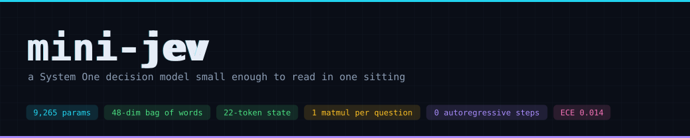
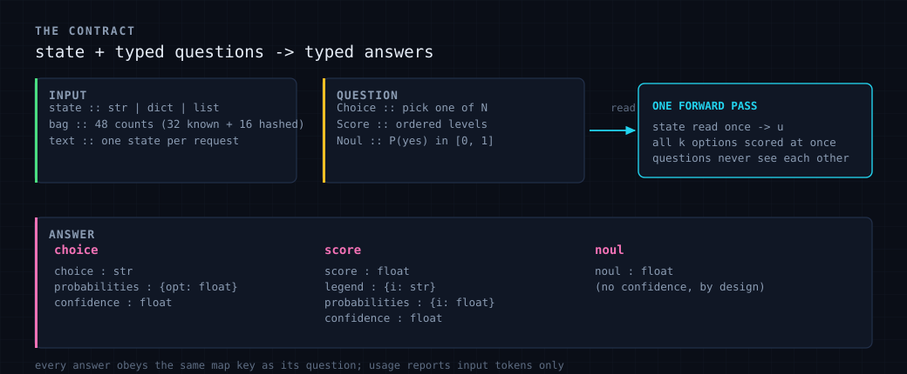
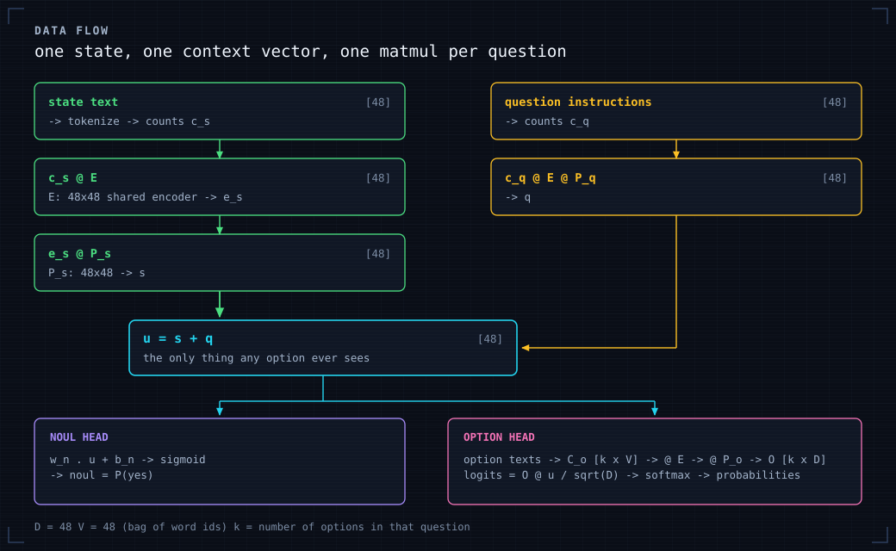
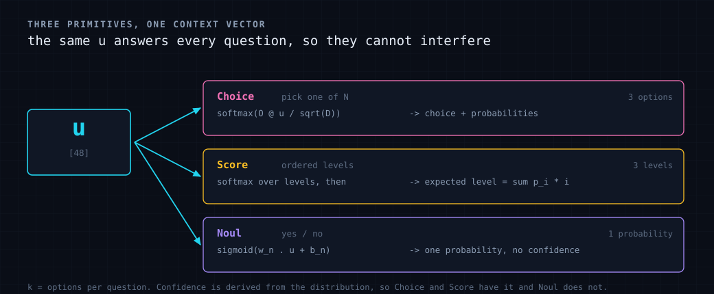
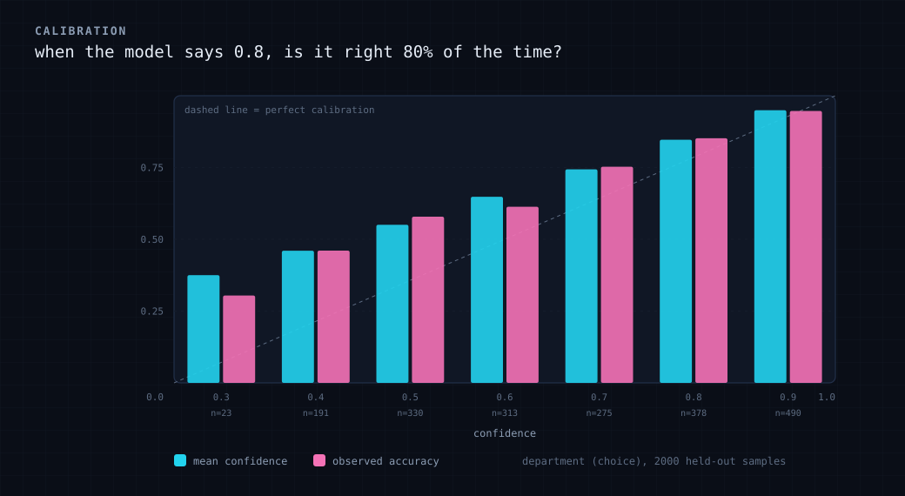
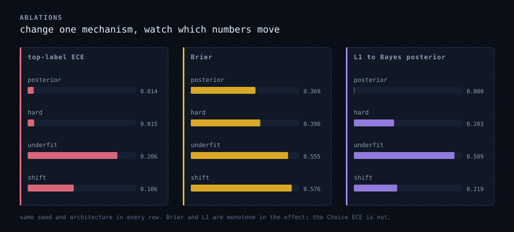
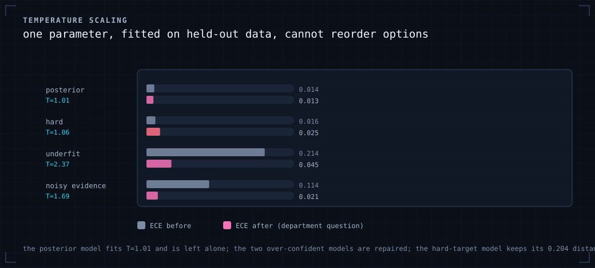
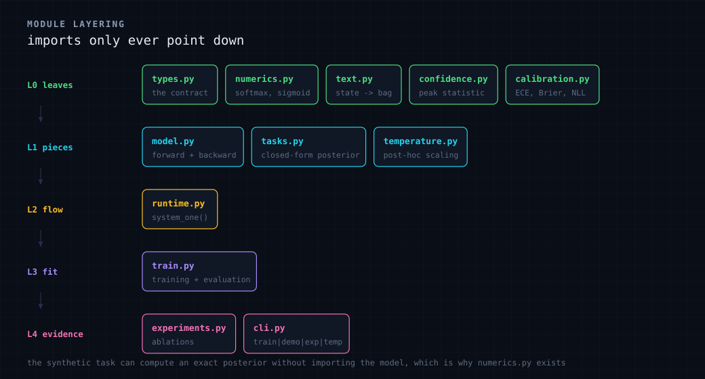

<div align="center">



<br>

`9,265 parameters` &nbsp;&middot;&nbsp; `numpy only` &nbsp;&middot;&nbsp; `trains in seconds` &nbsp;&middot;&nbsp; `0 autoregressive steps`

</div>

---

`mini-jev` is a small, from-scratch implementation of the typed decision
interface that TypeSafe AI's Jev exposes. You send a *state* and a set of
typed *questions*. You get back a probability distribution over the options
plus a confidence value that ordinary code can branch on.

```
state + questions  ->  one forward pass  ->  typed answers + probabilities + confidence
```

It is not a Jev clone, and it is not affiliated with TypeSafe AI. It is a small
model that speaks the same protocol, built around a task whose correct answer is
computable, so that claims about calibration can be checked instead of asserted.

New to the concepts? [`docs/JEV.md`](docs/JEV.md) is the knowledge base: the
three primitives, state, the evaluation model, confidence, calibration, the
known failure modes, and a table mapping every idea onto the file that carries it
here.

## Contents

| | |
| --- | --- |
| [Background](#background-what-jev-is) | what Jev is, from the official docs |
| [Quickstart](#quickstart) | install and run in four commands |
| [The contract](#the-contract) | request and response shapes |
| [How a request flows](#how-a-request-flows) | the data flow, with tensor shapes |
| [The three primitives](#the-three-primitives) | Choice, Score, Noul |
| [Results](#results) | what the model actually scores |
| [Ablations](#calibration-ablations) | what breaks calibration and what does not |
| [Temperature scaling](#temperature-scaling) | the part of the gap that is fixable |
| [Module layout](#module-layout) | how the code is organised |
| [Limits](#limits) | what this deliberately does not do |

## Background: what Jev is

From the official docs at <https://docs.typesafe.ai>, checked 2026-09-28. The
product moves quickly, so re-check anything you plan to depend on.

| | |
| --- | --- |
| What | Jev is TypeSafe AI's flagship model, described as the first "System One" model: built for fast, structured decisions that software consumes directly. |
| Endpoint | `POST https://api.typesafe.ai/v1/systemone` |
| Versions | `jev-1.13.0`, with aliases `jev-latest` and `jev-preview` |
| Input | Text only: a string, a JSON object, or an array of text. |
| Primitives | `Choice` (pick one), `Score` (ordered levels), `Noul` (probability that a yes/no statement holds) |
| Output | Typed values plus a full probability distribution. `Choice` and `Score` also return a confidence derived from that distribution. `Noul` returns one number and no confidence. |
| Training | RLCD, reinforcement learning for calibrated decisions, rather than RLHF, so that a stated 0.8 means "correct about 80% of the time". |
| Evaluation model | The state is read once and every question is scored in parallel and in isolation. Adding questions barely changes latency and cannot change another question's answer. |

## Quickstart

```bash
git clone https://github.com/AceIke/mini-jev && cd mini-jev
pip install -e .               # numpy is the only runtime dependency

python -m minijev train        # a few seconds, writes runs/triage/
python -m minijev demo         # ask the trained model a few tickets
python -m minijev experiments  # the calibration ablations, plus temperature scaling
python -m minijev temperature  # what post-hoc scaling can and cannot fix
python examples/data_flow.py   # print the numbers at every step of one request
python -m pytest -q            # 74 tests
python docs/make_figures.py    # regenerate every figure in docs/figures/
```

As a library:

```python
from minijev import Choice, Noul, Score
from minijev.runtime import MiniSystemOne

mini = MiniSystemOne.load("runs/triage")

result = mini.system_one(
    state="my card was charged twice, please refund asap",
    questions={
        "department": Choice(
            instructions="Which team should handle this ticket?",
            criteria={
                "billing":   "Charges, invoices, refunds and payment problems.",
                "technical": "Bugs, crashes, timeouts and integration failures.",
                "sales":     "Pricing, quotes, upgrades and demo requests.",
            },
        ),
        "is_urgent": Noul(instructions="Does the ticket convey urgency?"),
        "severity":  Score(
            instructions="How severe is the problem?",
            criteria=["Minor", "Moderate", "Blocking"],
        ),
    },
)

result.choice("department")        # 'billing'
result.probabilities("department") # {'billing': 0.552, 'technical': 0.275, 'sales': 0.173}
result.confidence("department")    # 0.33
result.noul("is_urgent")           # 0.739
result.score("severity")           # 0.763, a probability-weighted level
```

That confidence of 0.33 is the point of the interface. The message contains a
duplicate charge, a refund request and an urgency marker, so the output is a
spread-out distribution rather than a single label, and the calling code can send
it to a human instead of guessing.

## The contract



One request carries a state and any number of questions. One response carries one
answer per question id, under the same key. `usage` reports input tokens; outputs
are free in Jev's billing model, and this implementation mirrors that by
reporting zero.

## How a request flows



Three properties come out of that shape, and they are what make this a System One
model rather than a small language model:

1. The state is read once and becomes a single vector `u`.
2. All `k` options are scored by one matmul. Nothing is generated step by step.
3. Each question is a separate pass over the same `u`, so adding a question
   cannot change an existing answer.

`examples/data_flow.py` prints every intermediate value for one real state, and
then asks the same question alone and alongside the other two to show the two
probability vectors are bit-identical.

## The three primitives



`Noul` carries no confidence, by design, because the documented answer shape for
it has no confidence field. Asking for one raises a `TypeError` rather than
returning an invented number.

`Score` answers with the expected level, `sum(p_i * i)`, which is why it can land
between levels. The full distribution and a legend are returned alongside it.

## Results

Output of `python -m minijev train` on a laptop CPU:

```
parameters      9265
wall clock      6.37s          # timing varies by machine, the metrics do not
department   choice acc 0.736  ece 0.014  brier 0.369
is_urgent    noul   acc 0.876  ece 0.013  brier 0.098
severity     score  acc 0.767  ece 0.015  brier 0.321
```

### Why these numbers are checkable

The synthetic task has three latent variables (`department`, `is_urgent`,
`severity`), and each one drives its own disjoint vocabulary segment. Because the
segments do not overlap, the posterior factorises and is exact:

```
log P(department = j | tokens)  =  log P(j)  +  SUM_over_words  count(word) * log P(word | j)
```

That posterior is the Bayes-optimal predictor for this task, and it happens to be
linear in token counts, which is inside the model's hypothesis class. So the model
can reach the optimum, and the residual is measurable rather than rhetorical:

| metric | value |
| --- | --- |
| mean L1 distance to the Bayes posterior | `5e-08` |
| excess NLL over Bayes | `9e-11` nats |
| model accuracy / Bayes accuracy | `0.7355` / `0.7355` |

Calibration then becomes a consequence rather than a hope, and any deviation
would be a bug with a bisectable cause.

### Reliability



A model can be perfectly calibrated and still useless for gating decisions, so
the report also measures what happens when you act only on the confident cases:

| act on | department accuracy | is_urgent accuracy |
| --- | --- | --- |
| everything | 0.736 | 0.876 |
| the most confident 80% | 0.794 | 0.905 |
| the most confident 50% | 0.891 | 0.967 |

## Calibration ablations



Same seed and architecture throughout. `python -m minijev experiments`:

| variant | target | shifted eval | dept acc | dept ECE | dept Brier | L1 to Bayes | urgent ECE |
| --- | --- | --- | --- | --- | --- | --- | --- |
| `posterior_targets` | posterior | no | 0.736 | 0.014 | 0.369 | 0.0000 | 0.013 |
| `hard_targets` | realised one-hot | no | 0.713 | 0.015 | 0.396 | 0.2032 | 0.032 |
| `underfit` | posterior | no | 0.623 | 0.206 | 0.555 | 0.5088 | 0.120 |
| `evidence_shift` | posterior | yes | 0.571 | 0.106 | 0.576 | 0.2190 | 0.013 |

Reading the rows:

* `hard_targets` changes nothing except the training target, from the posterior
  to the realised outcome. Accuracy and the Choice ECE barely move, but the
  distance to the Bayes posterior jumps from 0.0000 to 0.2032, Brier gets worse,
  and the Noul ECE goes from 0.013 to 0.032. Training on outcomes makes the model
  confident about cases that are genuinely ambiguous. A single headline ECE would
  not have shown this.

* `underfit` is one pass over 1500 samples, roughly six optimiser steps. Accuracy
  falls and every calibration metric gets worse. Underfitting is a calibration
  failure, not only an accuracy failure.

* `evidence_shift` evaluates the same model where the evidence is weaker, so the
  true posterior is flatter than the model expects. ECE goes from 0.014 to 0.106.
  The Noul ECE does not move, because this shift only changes the topic cues.
  Calibration is a per-question property, not a global one.

One honest note on the Choice top-label ECE: it is the least stable of these
metrics. At the smallest training budget the hard-target run posts a lower Choice
ECE than the posterior-target run, because the posterior-target run is itself
underfit. Brier, NLL and distance to the posterior are monotone in the effect.
The Choice ECE is not. `docs/DESIGN.md` has the numbers for all three budgets.

## Temperature scaling



One parameter, fitted on data held out from the evaluation, no retraining. Given
a distribution `p` it returns `softmax(log(p) / T)`. `T > 1` softens an
over-confident model, `T < 1` sharpens an under-confident one, and since it only
rescales, it can never change which option wins.

| model | fitted T | ECE before | ECE after | NLL before | NLL after | L1 to Bayes before | L1 after |
| --- | --- | --- | --- | --- | --- | --- | --- |
| `posterior_targets` | 1.01 | 0.014 | 0.013 | 0.642 | 0.642 | 0.000 | 0.006 |
| `hard_targets` | 1.06 | 0.016 | 0.025 | 0.694 | 0.694 | 0.204 | 0.210 |
| `underfit` | 2.37 | 0.214 | 0.045 | 1.072 | 0.824 | 0.512 | 0.429 |
| `evidence_shift` | 1.69 | 0.114 | 0.021 | 0.982 | 0.928 | 0.222 | 0.093 |

Three things to take from this:

1. The model that already matches the posterior gets `T = 1.01` and nothing
   changes. That is the sanity check that the procedure is not fitting noise.
2. Underfitting and distribution shift both make the model over-confident, and a
   single parameter fitted on held-out data removes most of the resulting ECE:
   0.214 down to 0.045, and 0.114 down to 0.021.
3. The hard-target model also gets `T` near 1, and its distance to the posterior
   stays at 0.204. Rescaling fixes a distribution that is too peaked. It cannot
   fix one that is the wrong shape.

`is_urgent` and `severity` are unchanged by the shift, because the generator's
shift only touches the topic cues. The full twelve-row table is written to
`runs/experiments/report.md`.

## Module layout



```
src/minijev/
  types.py         the typed question and answer contract
  numerics.py      softmax and sigmoid, shared so nothing imports upward
  text.py          state serialisation, tokenisation, hashed vocabulary
  model.py         forward pass, hand-written backward pass, Adam
  confidence.py    the confidence statistic plus an entropy alternative
  calibration.py   ECE, MCE, Brier, NLL, reliability bins, selective accuracy
  temperature.py   post-hoc temperature scaling
  tasks.py         the synthetic generator and its closed-form posterior
  runtime.py       system_one(state, questions) -> typed answers
  train.py         training loop, evaluation, markdown report
  experiments.py   the ablations and the temperature comparison
  cli.py           train | demo | experiments | temperature
tests/             74 tests
examples/          one script that traces the data flow
docs/JEV.md        the concepts behind all of this
docs/DESIGN.md     why the implementation is shaped this way
docs/make_figures.py  regenerates every figure from live numbers
```

Imports only ever point down that list. `tasks.py` needs `softmax` but must not
import the model, which is why `numerics.py` exists as a leaf.

## Tests

| file | what it checks |
| --- | --- |
| `test_gradcheck.py` | the backward pass matches finite differences, per head |
| `test_tasks.py` | the closed-form posterior is calibrated against the sampler, which ties the tables, the sampler and the inference together |
| `test_calibration.py` | the metrics are correct on constructed ground truth |
| `test_confidence.py` | the confidence statistic reproduces the value printed in TypeSafe's docs |
| `test_temperature.py` | fitting recovers a known over-confidence factor, and rescaling preserves the answer |
| `test_runtime.py` | question independence, valid distributions, save and load, state shapes |
| `test_learns.py` | training reaches the Bayes optimum, each ablation moves as measured, and temperature scaling fixes over-confidence but not a wrong shape |

## Limits

* Bag of words, so no word order and no syntax. This is what keeps the Bayes
  posterior exact and the code short.
* Synthetic vocabulary only. Unseen words hash into fixed buckets, so nothing
  crashes and nothing is understood either.
* Fixed-length states, so the model never has to decide how much a longer state
  should count.
* No context management. Jev documents a 64k request budget with a 32k
  sub-budget for the state plus the longest question. This never needs one.
* Soft targets need a known posterior, which only exists because the task is
  synthetic. On real data you have outcomes, which is the `hard_targets` row.
* No serving layer. The wire format lives in `types.py` as `to_wire` and
  `from_wire`, which is enough to show the contract without maintaining a server.

## Where to take it next

* Per-class ECE in the CLI report. The metric exists as `classwise_ece`.
* A cumulative-link `Score` head, since a softmax over levels ignores their order.
* Length-aware confidence, so a longer state can legitimately be more confident.
* A transformer encoder in place of the bag of words. The synthetic target then
  stops being computable, so the evaluation story moves to held-out outcomes and
  the gradient check has to be replaced with a float64 CPU check.
* Calibration methods past temperature scaling: vector scaling, Dirichlet
  calibration, or an explicit abstention class.

## References

* TypeSafe AI documentation, <https://docs.typesafe.ai>. The Introduction, System
  One, State, Primitives, Confidence, AI primer, Models, API reference and model
  jaggedness pages are the source for everything attributed to the docs here.
* TypeSafe AI on GitHub, <https://github.com/typesafe-ai>, for the official Python
  and TypeScript SDKs.
* Guo et al., "On Calibration of Modern Neural Networks", 2017, for ECE and the
  classwise variant used in `calibration.py`.
* Kahneman, "Thinking, Fast and Slow", for where the System One name comes from.

## License

MIT. Not affiliated with TypeSafe AI. "Jev", "TypeSafe" and "System One" are used
descriptively, and every product fact above is cited to the public documentation
with the date it was checked.
